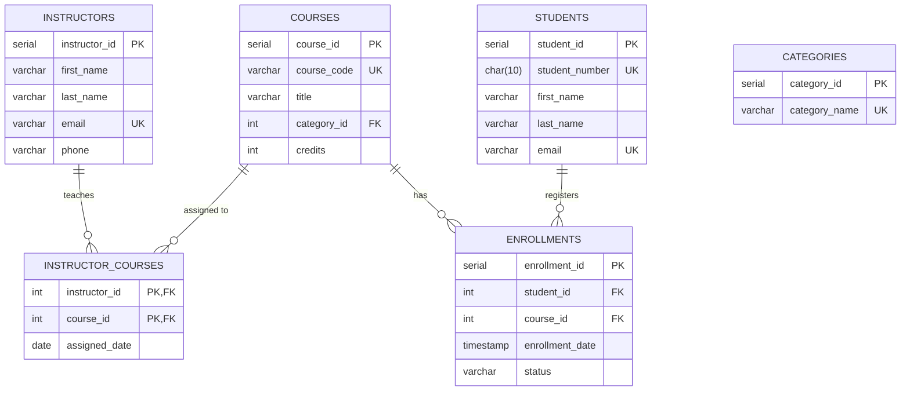

# Course Registration System - ER Diagram

```mermaid
erDiagram
INSTRUCTORS ||--o{ INSTRUCTOR_COURSES : "teaches"
COURSES ||--o{ INSTRUCTOR_COURSES : "assigned to"
STUDENTS ||--o{ ENROLLMENTS : "registers"
COURSES ||--o{ ENROLLMENTS : "has"

CATEGORIES {
serial category_id PK
varchar category_name UK
}

INSTRUCTORS {
serial instructor_id PK
varchar first_name
varchar last_name
varchar email UK
varchar phone
}

COURSES {
serial course_id PK
varchar course_code UK
varchar title
int category_id FK
int credits
}

INSTRUCTOR_COURSES {
int instructor_id PK, FK
int course_id PK, FK
date assigned_date
}

STUDENTS {
serial student_id PK
char(10) student_number UK
varchar first_name
varchar last_name
varchar email UK
}

ENROLLMENTS {
serial enrollment_id PK
int student_id FK
int course_id FK
timestamp enrollment_date
varchar status
}
```
